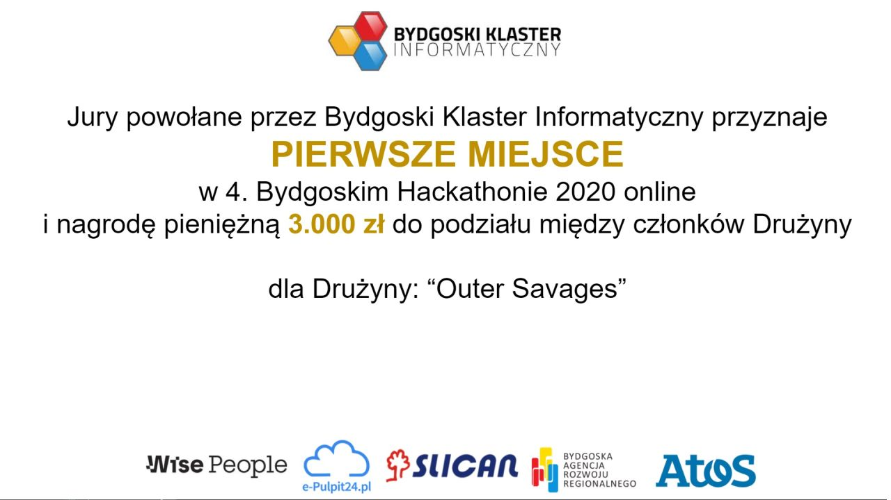
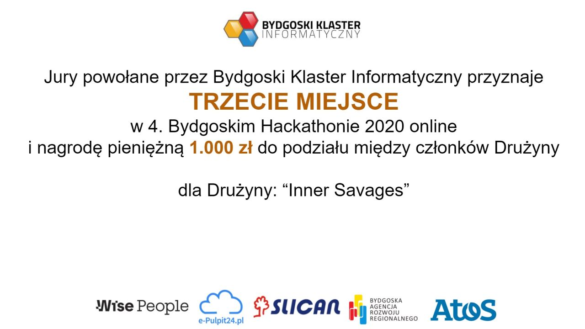

Podwójny sukces członków naszego stowarzyszenia!!! Zespoły Outer Savages oraz Inner Savages zdobywają 1 i 3 miejsce na 
tegorocznym 4. Bydgoskim Hackathonie.

<!-- end -->

Chcielibyśmy serdecznie podziękować Bydgoskiemu Klastrowi Informatycznemu za możliwość wzięcia po raz kolejny
udziału w Bydgoskim Hackathonie.

Impreza w tym roku odbyła się online i miała charakter międzynarodowy. Zespoły pracowały nad swoimi pomysłami przez
24 godziny od 18:00 w piątek 20 listopada do godziny 18:00 w sobotę 21 listopada.

Gratulujemy członkom naszego stowarzyszenia, którzy zdobyli 1 oraz 3 miejsca na podium.

__Outer Savages__ w składzie:
 - Monika Mohylowska
 - Janek Baumgart
 - Andrzej Borowicz
 - Łukasz Szymański  
 
zdobywają 1 miejsce projektem __Smart Sharing__.

__Inner Savages__ w składzie:
 - Izabela Skora
 - Jakub Skory
 - Jakub Zięba  

zdobywają 3 miejsce projektem __W Kontakcie__.

Gratulujemy wszystkim zwycięzcom i uczestnikom. Do zobaczenia za rok!
