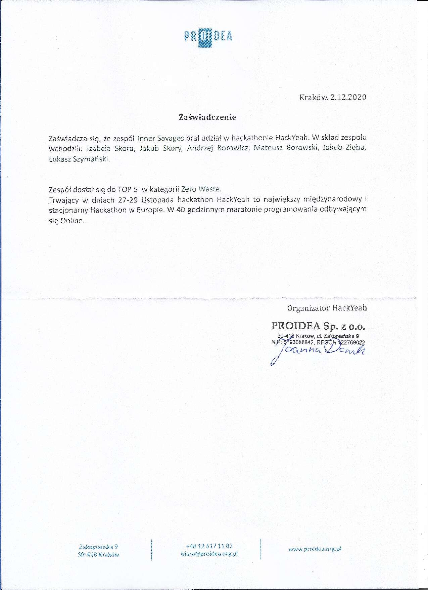

27-29 listopada 2020 wzięliśmy udział w HackYeah 2020 Online November. Imprezę zakończyliśmy z drobnym, aczkolwiek
satysfakcjonującym sukcesem.

<!-- end -->

Chcieliśmy serdecznie podziękować organizatorom. To już trzeci raz, gdy wzięliśmy udział w tej imprezie,
pierwszy natomiast jako stowarzyszenie.

Przez 40 godzin pracowaliśmy nad projektem [re-wrap.it](https://re-wrap.it/) w ramach kategorii __Zero Waste__. 
Zakwalifikowaliśmy się do finału top5 w ramach kategorii.

__Inner Savages__ reprezentowali:
 - Izabela Skora
 - Jakub Skory
 - Mateusz Borowski
 - Andrzej Borowicz
 - Jakub Zięba  
 - Łukasz Szymański 

Do zobaczenia za rok!
